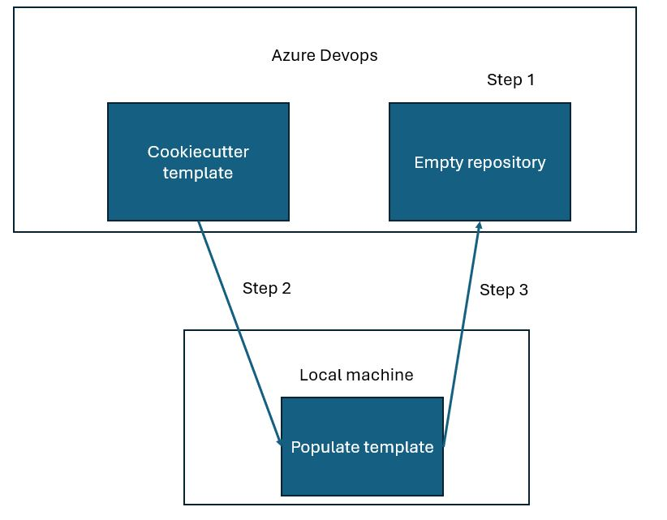
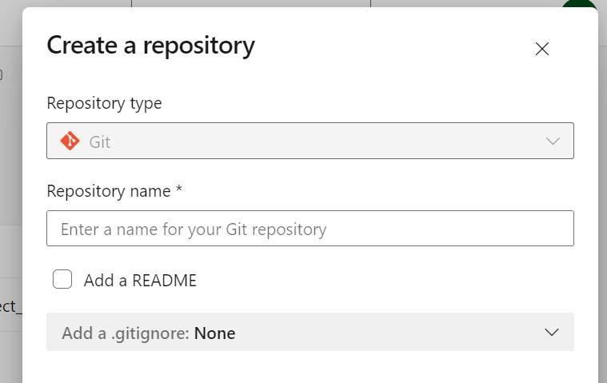
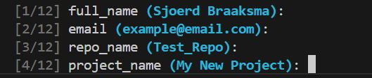

# UWC_chatbot Table of Contents

<!-- vscode-markdown-toc -->
- [Introduction](#introduction)
- [Setting up SSH](#setting_up_ssh)
- [Setting up a repository](#setting-up-a-repository)
- [Installing a repository](#installing-a-repository)
- [Code standards](#code-standards)
- [Continuous integration pipeline](#continuous-integration-pipeline)
<!-- vscode-markdown-toc-config
	numbering=false
	autoSave=false
	/vscode-markdown-toc-config -->
<!-- /vscode-markdown-toc -->

---
## Introduction

This Readme file will walk you through all the stages of running the code in this repository.
If you have already set up your repo, you can skip the Repo setup steps.

This repo is made from a reusable template using cookiecutter. If you want to know more about cookiecutter, see [the documentation](https://cookiecutter.readthedocs.io/en/1.7.2/index.html)
<br />
<br />

## Setting up SSH

First, we need to connect our compute instance (local machine) to azure devops using SSH. This ensures Azure DevOps "trusts" our local machine and knows it's us. That way, you don't have to input your username and password every time you push and pull code to the repository.

See the step-by-step way of setting up SSH [here](https://learn.microsoft.com/en-us/azure/devops/repos/git/use-ssh-keys-to-authenticate?view=azure-devops)

If it's not installed, also install git in your local environment and set the global environment variables for

<br />
<br />

## Setting up a repository

When starting a project, you need to set up a repository. We want to do this by using our cookiecutter template as a, well, template. This works a bit differently than setting up a normal repository:
1) First, we want to create an empty repository for our project.
2) Second, want to __pull__ the cookiecutter template __into__ our local workspace. This triggers the cookiecutter template proces where we create our repository locally.
3) Third, we then __push__ our local repository __into__ the empty repository we created, populating it with your nice filled/in template.

<br />

<br />

First, start by creating an emtpy repository in Azure DevOps.
Uncheck the option to make a .gitignore and readme.

<br />

<br />

Second, in your local workspace, make sure cookiecutter and git are installed. You can check both by running "cookiecutter" and "git" in your workspace.
You can install them by running:

```
python3 -m pip install

# and

sudo apt install git-all
```

On to the second step! Make sure you have a project folder where we will clone the cookiecutter repository into. It is recommended to have a folder with the same name as your project slug. Where you will copy the repository into. yes, this creates two folders with the same name, but will make sure you have a place to put repository-specific files that you don't want to push to your repository on accident. See an example below.

```
│   └── {{cookiecutter.project_slug}} <-- You made this folder!
│       ├── cookiecutter.json
│       ├── hooks
│       │   └── post_gen_project.py
│       ├── requirements_dev.txt
│       └── {{cookiecutter.project_slug}}
│           ├── LICENSE
│           ├── README.md
│           ├── app
│           │   └── {{cookiecutter.project_slug}}
│           │       ├── __init__.py
│           │       └── {{cookiecutter.project_slug}}.py
│           ├── changelog.md
│           ├── conda_env.yaml
│           ├── init_conda.sh
│           ├── init_env.sh
│           ├── pyproject.toml
│           ├── pytest.ini
│           ├── requirements.txt
│           └── tox.ini
```
Next, clone the repository using cookiecutter. Cookiecutter automatically recognizes that it's a repository, and starts the cookiecutter process. To guide you through filling out the template. At the end, it will ask you to initialize the environment. If you accept, a script is run that installs miniconda and automatically creates the conda environment with the given project name.

<br />

<br />


For the last step, we want to push this filled-out template as a first commit to our empty repo. Follow the steps below in your local environment.

```
# Create a local git repository with the main branch
git init -b main

# Add all of the files in the repository to that repository
git add .

# Add the remote empty git repo as the origin
git remote add origin <REMOTE-REPO-URL>

# test that you have added the remote repo
git remote -v

# commit all your files
git commit -m "First commit"

# Push the files to the remote repo
git push origin main
```

<br />
<br />

## Installing a repository
This step assumes someone has already created the repository from the cookiecutter template. This step is then used by others to install the correct environment from this repo and get started.

### installing miniconda
First, start by cloning this repo into your local folder.

Second, we install miniconda. This is a more lightweight version of anaconda.
Miniconda is a package manager that we will use to create an isolated environment to install our packages and dependencies to.
After this initial setup however, we prefer to use poetry when adding new packages and updating the environment, since it is far better at maintaining a stable environment throughout the course of development.

Start by installing miniconda3 by running these lines in your terminal
```
mkdir -p ~/miniconda3
wget https://repo.anaconda.com/miniconda/Miniconda3-latest-Linux-x86_64.sh -O ~/miniconda3/miniconda.sh
bash ~/miniconda3/miniconda.sh -b -u -p ~/miniconda3
rm -rf ~/miniconda3/miniconda.sh
```


Initialize your environment
```
~/miniconda3/bin/conda init bash
~/miniconda3/bin/conda init zsh
conda init
```
<br />
<br />

### Setting up the miniconda environment

Now we are going to create our environment using miniconda.
Make sure you are in the same folder as the conda_env.yaml file, and run:

```
conda env create -f conda_env.yaml
```

This creates the environment. You can see your environments with:

```
conda env list
```

activate your environment using:
```
conda activate <environment_name>
```

For more in-depth information how to use conda, see the [conda documentation](https://docs.anaconda.com/miniconda/)

### Additional functionalities

The anaconda environment has installed some packages you might not be familiar with, but are integral to maintaining code quality and stability.

#### Poetry
Poetry is our tool for installing new packages. It works well with anaconda. When you install packages using poetry, it installs automatically in your currently active conda environment.

To install the defined dependencies for your project, just run the install command.
```
poetry install
```
If you have never run the command before and there is also no poetry.lock file present, Poetry simply resolves all dependencies listed in your pyproject.toml file and downloads the latest version of their files.

When Poetry has finished installing, it writes all the packages and their exact versions that it downloaded to the poetry.lock file, locking the project to those specific versions. You should commit the poetry.lock file to your project repo so that all people working on the project are locked to the same versions of dependencies (more below).

This brings us to the second scenario. If there is already a poetry.lock file as well as a pyproject.toml file when you run poetry install, it means either you ran the install command before, or someone else on the project ran the install command and committed the poetry.lock file to the project (which is good).

Either way, running install when a poetry.lock file is present resolves and installs all dependencies that you listed in pyproject.toml, but Poetry uses the exact versions listed in poetry.lock to ensure that the package versions are consistent for everyone working on your project. As a result you will have all dependencies requested by your pyproject.toml file, but they may not all be at the very latest available versions (some dependencies listed in the poetry.lock file may have released newer versions since the file was created). This is by design, it ensures that your project does not break because of unexpected changes in dependencies.


During development, you can add new packages with:
```
poetry add <package>
```

The preferred way of adding packages is to first try poetry. If that fails, try miniconda. If that fails, try using pip.

For more in-depth information, see [the documentation](https://python-poetry.org)

#### pre-commit-config

Pre-commit installs a set of hooks (small functions) in your environment that do automatic code quality checks for us, and corrects a few for us. Other coding mistakes will pop up as warnings, which you can then fix. The main file that controls these settings is the .pre-commit-config.yaml.

The standard procedure is to run these checks before you commit your code to the repository.
You can run the checks on all your staged files using:

```
pre-commit run
```

You can also run pre-commit on **all** files in the repository by running:
```
pre-commit run --all-files
```

In some cases, pre-commit catches inappropriate errors, or simply flags code as wrong that it doesn't understand (like dataclasses). In these cases, you can use tags to ommit certain parts of your code from certain pre-commit checks. As a general rule, try to keep these as tightly scoped and specific as possible. If only one check fails on a certain function, exclude that function from that specific checks.
Wide-sweeping omissions of checks is not advised, as this deteriorates the quality of the code in the long run.

For more in-depth information, see [the documentation](https://pre-commit.com/)
<br />
<br />

## Code standards

The following code standards & style guides should be adhered to throughout development:

__PEP8:__ [See documentation](https://peps.python.org/pep-0008/)

In general, the google python style guide is a good additional guideline, but is not strictly enforced

__Google style guide:__ [See documentation](https://google.github.io/styleguide/pyguide.html)

## Continuous integration pipeline

This repository provides two options out of the box for running pipelines, azure pipelines and github actions. You can find all the settings in their respective folders: .azuredevops and .github

For more in-depth information, see [Azure pipelines](https://learn.microsoft.com/en-us/azure/devops/pipelines/get-started/what-is-azure-pipelines?view=azure-devops)

or, for github see [Github actions](https://docs.github.com/en/actions)
test
